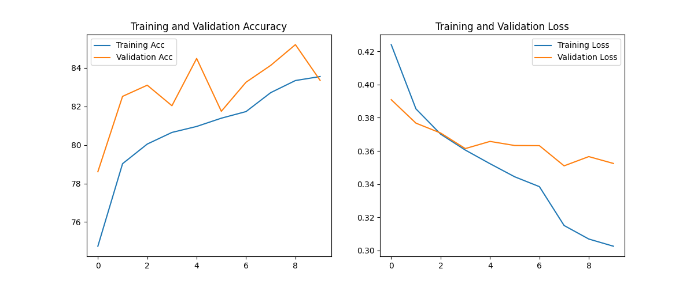
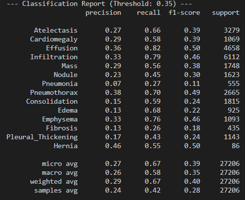
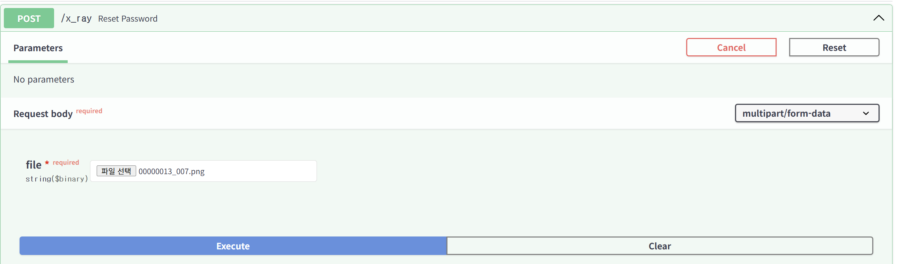

# 흉부 X-ray 판독 효율화를 위한 AI 기반 CDSS 솔루션
denseNet-121 적용

### train, val 관계 그래프


### test 결과표 


### FastAPI 적용


```
Response body
{
  "filename": "D:/healthcare/healthcare/data/images/4a04ec06-fce5-4590-a1a2-3034aa0de89d.png",
  "predictions": [
    {
      "label": "Atelectasis",
      "probability": "53.2%",
      "image_url": "http://localhost:8000/results/2448eeac-0404-461c-b268-9ea22263d11d_Atelectasis.png"
    },
    {
      "label": "Cardiomegaly",
      "probability": "35.7%",
      "image_url": "http://localhost:8000/results/2658404b-a029-4637-b443-ce2381a4d285_Cardiomegaly.png"
    },
    {
      "label": "Effusion",
      "probability": "63.2%",
      "image_url": "http://localhost:8000/results/e8fbe2ff-15f6-4837-b7b5-853154824da8_Effusion.png"
    },
    {
      "label": "Infiltration",
      "probability": "55.2%",
      "image_url": "http://localhost:8000/results/84722214-ba71-4dec-8ed2-ac37da9a3162_Infiltration.png"
    },
    {
      "label": "Mass",
      "probability": "15.7%",
      "image_url": "http://localhost:8000/results/a6f8cd48-f869-406b-89de-385c0b81715e_Mass.png"
    },
    {
      "label": "Nodule",
      "probability": "6.9%",
      "image_url": "http://localhost:8000/results/e0064955-b098-4fd0-9f3d-8147894a69f8_Nodule.png"
    },
    {
      "label": "Pneumonia",
      "probability": "10.6%",
      "image_url": "http://localhost:8000/results/40a133c3-4b5a-49a4-bc9a-78f23ee25d5a_Pneumonia.png"
    },
    {
      "label": "Pneumothorax",
      "probability": "25.5%",
      "image_url": "http://localhost:8000/results/4b333a6d-b59d-4116-ab30-f93dcd795c98_Pneumothorax.png"
    },
    {
      "label": "Consolidation",
      "probability": "57.5%",
      "image_url": "http://localhost:8000/results/9632bb22-8f9c-4fec-b3ff-a635fa56fb40_Consolidation.png"
    },
    {
      "label": "Edema",
      "probability": "9.4%",
      "image_url": "http://localhost:8000/results/c2395233-aae8-4364-a657-8b391c049460_Edema.png"
    },
    {
      "label": "Emphysema",
      "probability": "21.1%",
      "image_url": "http://localhost:8000/results/1a6ea44b-aa50-4013-9e16-6f0614fb5b39_Emphysema.png"
    },
    {
      "label": "Fibrosis",
      "probability": "1.1%",
      "image_url": "http://localhost:8000/results/617e2db2-30c2-40c1-bbbe-45db2eee4709_Fibrosis.png"
    },
    {
      "label": "Pleural_Thickening",
      "probability": "17.7%",
      "image_url": "http://localhost:8000/results/1789b2a0-a164-48d6-9a8a-e43b866b1978_Pleural_Thickening.png"
    },
    {
      "label": "Hernia",
      "probability": "1.6%",
      "image_url": "http://localhost:8000/results/051c8318-fdfa-4073-b564-94d935e4b9d0_Hernia.png"
    }
  ]
}
```

라벨에 따른 결과 출력