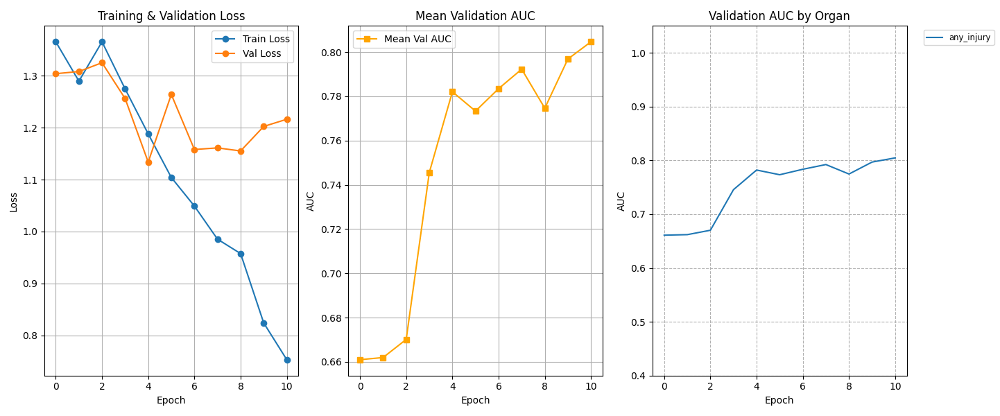
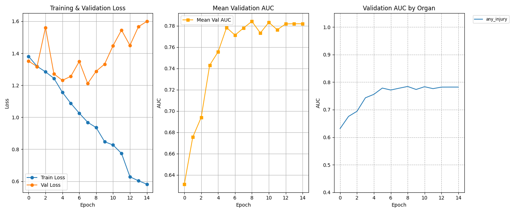
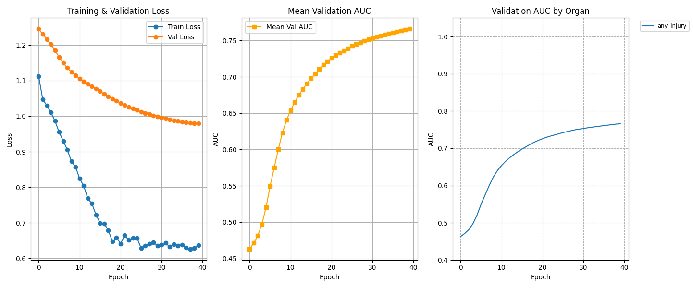
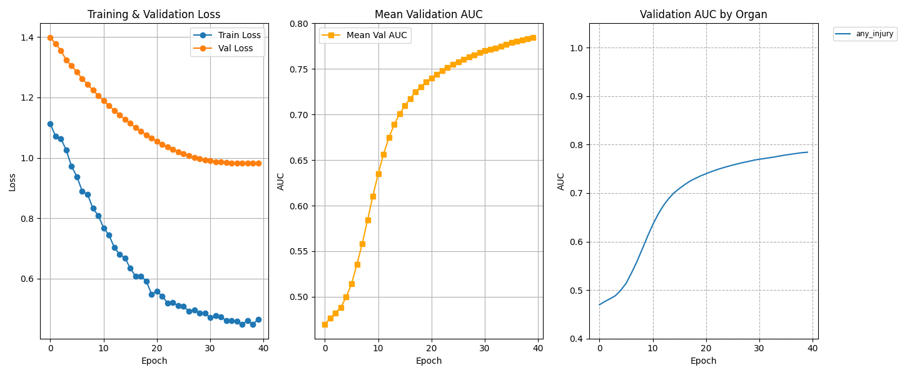

# 의료 영상 판독 보조 AI 파이프라인
> **"의료진의 확진을 돕기 위한 합리적인 의심"**  
> 진단 누락의 사각지대 없이, '이상 소견'을 가장 먼저 포착하여 한 번 더 확인을 권고하는 딥러닝 보조 모델 포트폴리오.


*가장 뛰어난 '위급성(부상)' 포착 성능을 보인 모델(v11)의 검증(AUC) 결과*

## 프로젝트 핵심은 "의심"

본 모델의 개발 목표는 "AI가 의사를 대신하여 완벽한 병명을 교만하게 진단"하는 것이 아닙니다. 
의료 현장에서 발생할 수 있는 치명적인 **'진단 누락(False Negative)'을 방지**하기 위해, **"부상일 확률이 높은 구역을 먼저 포착하여 의료진의 재검토를 유도하는 경고등 역할"**을 수행하는 데 초점을 맞추었습니다. 

이를 위해 단순 정답률(Accuracy) 향상이 아닌, 얼마나 응급한 환자를 놓치지 않는가를 판단하는 **모형의 교차 검증 역량(AUC)**과 악조건 속에서도 의심을 유지하는 **데이터 강건성(Robustness)**에 집중하여 파이프라인을 최적화했습니다.

## 데이터
- CT 데이터:
  - RSNA 2023 Abdominal Trauma Detection: https://www.kaggle.com/competitions/rsna-2023-abdominal-trauma-detection
- 전처리 데이터셋:
  - 128 해상도: https://www.kaggle.com/datasets/yoodeoksu/rsna-2023-atd-preprocessed-s128
  - 224 해상도: https://www.kaggle.com/datasets/yoodeoksu/rsna-2023-atd-preprocessed-s224

## 기술 스택 (Tech Stack)
- **Deep Learning Framework**: PyTorch, PyTorch Image Models (timm)
- **Medical & Vision Libs**: MONAI
- **Model Architecture**: ConvNeXt-Tiny, Transformer Encoder
- **Training Optimization**: EMA (Exponential Moving Average), LLRD, Stochastic Depth, Label Smoothing

## Core Architecture: '의심'을 찾기 위한 기술적 선택

64장의 3D 복부 CT 슬라이스 중 어느 한 곳에 숨어있을지 모르는 출혈 및 미세 부상을 찾기 위해, **ConvNeXt + Attention Pooling (2.5D 하이브리드)** 형태의 모델을 설계했습니다.

```text
1. [시각 신경망] ConvNeXt-Tiny
   - 한 컷 한 컷(단일 슬라이스)의 2D 특징(Feature)을 빠르게 스캔하여 고차원 벡터로 추출.
    ↓
2. [핵심 포착 심사위원] Attention Pooling
   - 64장의 슬라이스 특징 중 부상 의심 지점이 가장 큰 곳에 동적으로 높은 가중치를 부여.
   - 단순 평균(Average)이 아닌 가중합(Weighted Sum)을 내어 '결정적 의심 슬라이스'에 집중함.
    ↓
3. [전문의 판별] 헤드 분리 기반 다중 진단
   - 전체 복부 부상 유무(위급성)를 일차적으로 알리는 `suspicion_head`
   - 개별 장기(Bowel, Liver 등)의 정밀 진단을 수행하는 `organ_heads`
```
**기술적 판단**: 무겁고 연산량이 많은 3D Transformer 융합 시도(v3)보다 오히려 직관적인 Attention 필터링 기법이 고해상도(224) 의료 영상에서 더 빠르고 예민하게 이상 징후를 캐치(최고 AUC)해 냄을 증명했습니다.

---

## 트러블슈팅 및 성능 고도화 과정 (v1 ~ v15)

"어떻게 하면 의심의 감각을 잃지 않되, 불필요한 헛지목(오탐)은 줄일 수 있을까?"에 대한 실험을 고도화한 로그입니다.

### 1. 의심의 초점 맞추기 (Gating & Injury-Only)
* **문제 (v1~v3)**: 각 장기의 손상(Bowel, Liver, Spleen 등)을 독립적으로 분리 예측하려다 보니, 진짜 위급한 상황인지에 대한 모델의 '의심 판단력'이 분산되어 오탐 빈도 발생.
* **해결 (v4 Gating 구조 도입)**: "환자의 복부가 진짜 다쳤는가?"를 알려주는 전체 총괄 부상 확률(`suspicion_head`)을 우선 도출한 직후, 그 확률을 세부 장기 확률에 곱해주는 계층 구조를 설계하여 불필요한 의심 억제.
* **결과 (v11 입증)**: 장기별 '병명 구분'을 덜어내고, 오직 "이상 여부(위급성)" 자체에만 집중적으로 신경 썼을 때 예측 성능이 **AUC 0.8124**로 비약적 상승함을 확인하며 모델의 '판단 대상 압축' 효과를 스스로 증명. 

### 2. 신중하고 보수적인 의심의 훈련 과정 (최신 정규화 이식)
* **문제**: 의료 데이터 특성상, 파라미터가 깊어지면 모델이 특정 노이즈를 부상으로 과잉 해석(과적합)하여 검증 Loss 튀어 오르는 모델 흔들림 현상 발생.
* **해결 (v14/v15 - 최신 논문 훈련 기법 이식)**: 
  * **EMA (Exponential Moving Average)**: 가중치 변화를 단번에 받아들이지 않고 미세하게 평균 내는 '그림자(Shadow) 모델'을 적용, 성급한 헛지목 방지.
  * **차등 학습률 (LLRD)**: 이미지를 보는 시각 신경망(Backbone)은 아주 낮게(`1e-6`), 의심을 판단하는 뇌(Head)는 기존 속도(`1e-4`)로 스케줄링하여 과거 추출 스킬의 파괴 방지.
  * **결과**: 위 규제들(Stochastic Depth, Warm Restart 등) 적용 후 깊은 에포크(40)에서도 안정적인 우상향(AUC 0.7843)을 그리는 일반화 성능 획득.

### 3. '의심 감각'의 맷집 테스트 (Ablation Study)
* **증강 제거 실험 (v8)**: '의심 센서'를 기르는 데 있어서 악조건(외곡 등) 환경 조성이 직결됨을 증명하기 위해 데이터 Augmentation을 아예 제거 후 학습. 
* **결과**: 검증 성능이 0.69대까지 완전히 폭락함을 확인하였으며, 이로써 다양한 회전/변형 속에서도 일관되게 '의심'할 수 있는 의료 영상 내 데이터 증강의 필수 가치를 수치로 반증함.

---

## 프로젝트 요약 및 의의

1. **임상적 환경 맞춤 AI 모델링 역량**: '맹목적 분류 성능 향상'이 아니라, **'진단 누락 최소화와 한 번 더 확인(의심)'**이라는 확실한 비즈니스/임상적 논리를 바탕으로 Loss 가중치(Class Weight)와 구조(Gating)를 재조립한 거시적 아키텍처 설계 능력을 입증했습니다.
2. **트렌디한 비전 딥러닝 기술의 실전형 이식**: 최신 트렌드 레퍼런스인 *A ConvNet for the 2020s*의 모범 훈련 기법(EMA, LLRD 등)들을 파이프라인 상황과 의료 도메인에 맞게 이식 및 최적화하는 데 성공했습니다.
3. **최종 모델 검증 목표 달성 (Best AUC)**: 
   - 의심 포착(부상 및 위급성 판별) 특화 모델 (v11): **최고 성능 AUC 0.8124**
   - 다중 장기 정밀 진단 밸런스 모델 (v10 / v15): **AUC 0.7791 / 0.7843**의 단단한 안정성 구축.

---

## 버전별 실험 및 성능 요약 표

| Version | 핵심 실험 내용 및 변화 포인트 | Best AUC |
|:---|:---|:---:|
| **v1** | Baseline 셋업, `128x128` ConvNeXt 부분 동결 | 0.7738 |
| **v2** | 동결(Freeze) 에폭 기간 및 하이퍼파라미터 튜닝 | 0.6793 |
| **v3** | Transformer Encoder 시도 (복잡도로 인한 한계 확인) | 0.6892 |
| **v4** | Gating 계층 구조 도입 (의심 필터링) | 0.7070 |
| **v5~v7** | `224x224` 해상도 상향 및 불균형 Class Weight 최적화 | 0.74~0.75대 |
| **v8** | Augmentation 완전 제거 실험 (성능 폭락 확인) | 0.6951 |
| **v10** | **Best Full-Model** (단순 2.5D Attention Pooling 구조 복귀) | **0.7791** |
| **v11** | **위급성 타게팅 특화** (Injury-Only 집중 학습) | **0.8124** |
| **v14~v15** | **최신 정규화 이식** (EMA, LLRD, Stochastic Depth 안정화) | **0.7843** |

---

<details>
<summary>▶ <strong>전체 버전 상세 결과 아카이브 (총 15+ 실험 버전의 AUC 검증 그래프) 펼쳐보기</strong></summary>

*(기존 15개의 점진적 실험 로그 그래프들은 포트폴리오 가독성을 위해 토글 안에 압축 보관합니다. 클릭하시면 전체 역사를 확인하실 수 있습니다.)*

- **v1_2 (AUC: 0.7738)**: `assets/ct_result_history_1_2.png`
  <br>

- **v2 (AUC: 0.6793)**: `assets/ct_result_history_2.png`
  <br>

- **v3 (Transformer 도입 / AUC: 0.6892)**: `assets/ct_result_history_3.png`
  <br>

- **v4 (Gating 적용 / AUC: 0.7070)**: `assets/ct_result_history_4.png`
  <br>

- **v5_2 (해상도 224 상향 / AUC: 0.7529)**: `assets/ct_result_history_5_2.png`
  <br>

- **v6_4 (Custom 가중치 적용 / AUC: 0.7524)**: `assets/ct_result_history_6_4.png`
  <br>

- **v7 (경사 누적(Gradient Accumulation) / AUC: 0.7474)**: `assets/ct_result_history_7_2.png`
  <br>
  - Kaggle Public Score 확인: <br>

- **v8 (증강 제거 실험 / AUC 폭락)**: `assets/ct_result_history_8.png`
  <br>

- **v9 (증강 복구 및 LLRD / AUC 안정화)**: `assets/ct_result_history_9.png`
  <br>

- **v10 (병명 포함 학습 Best / 최고성능 0.7791)**: `assets/ct_result_history_10.png`
  <br>

- **v11 (부상 및 위급성 의심 특화로 변경 / 최고성능 AUC: 0.8124)**: `assets/ct_result_history_11.png`
  <br>

- **v12 (BCEWithLogitsLoss 확인 / AUC: 0.8047)**: `assets/ct_result_history_12.png`
  <br>

- **v13 (Transformer 재적용 / AUC: 0.7842)**: `assets/ct_result_history_13.png`
  <br>

- **v14_2 (EMA, LLRD, Warm Restart 등 / AUC: 0.7660)**: `assets/ct_result_history_14_2.png`
  <br>

- **v15 (최신 정규화 기법 최적화 / AUC: 0.7843)**: `assets/ct_result_history_15.png`
  <br>

</details>