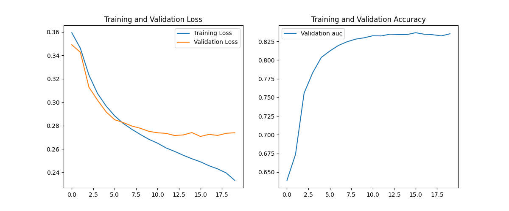
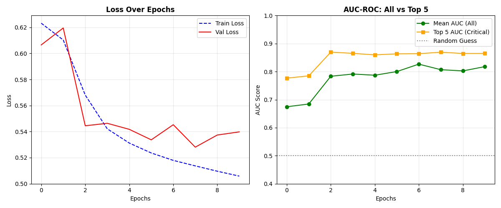
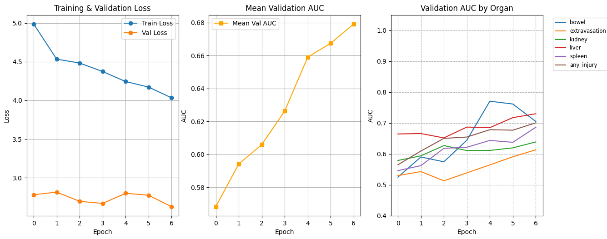
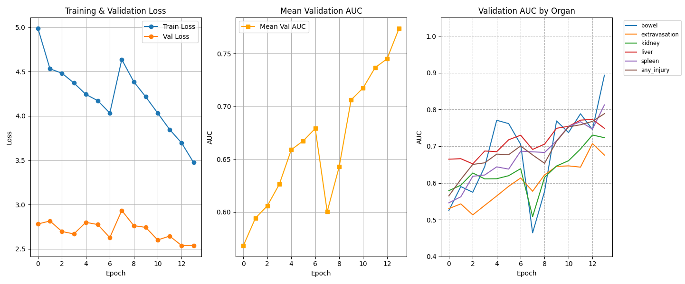
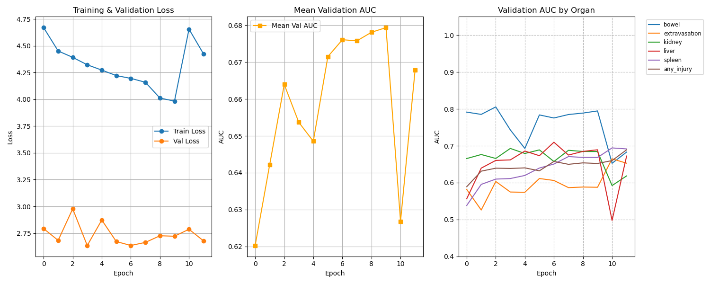

# 흉부 X-ray 판독 효율화를 위한 AI
- train and test data
    - chest x-ray : https://www.kaggle.com/datasets/ashery/chexpert
    - chest x-ray : https://www.kaggle.com/datasets/nih-chest-xrays/data
    - ct : https://www.kaggle.com/competitions/rsna-2023-abdominal-trauma-detection
    - ct 전처리 : https://www.kaggle.com/datasets/yoodeoksu/rsna-2023-atd-preprocessed-s128

- x-ray
    - denseNet-121 전이학습, 증강, 2 에포크까지 동결, 가중치(log처리)
    - x-ray_NIH_denseNet-121.py
        - HIH 흉부 x-ray 데이터
        - NIH 결과 
    - x-ray_chexpert-densenet121.ipynb
        - 다른 흉부 x-ray 데이터
        - chexpert 결과 

- ct
    - 전처리 코드 : ct-preprocessed.ipynb
        - (64, 128, 128) 처리
        - 손상된 DICOM 파일 거르기 + monai 처리
    - 학습 코드_1 : ct-convnext-base-s128_1.ipynb
        - 2 에포크 동결, 증강, any_injury 가중치 처리
         
    - 이어서 학습 코드_1 : ct-convnext-base-s128-continue-learning.ipynb
        - 캐글에서 timeout에 걸려 7에포크 부터 이어서 처리
        - 옵티마이저(optimizer) 초기화
        - 
    - 이어서 학습 코드_1 : ct-convnext-base-s128-continue-learning_2.ipynb
        - 캐글에서 timeout에 걸려 14에포크 부터 이어서 처리
        - 옵티마이저(optimizer) 이전값 이어서 처리
        - 
    - 학습 코드_2 : ct-convnext-base-s128_2.ipynb
        - 10 에포크 동결, lr = 1e-4 -> 1e-5, weight_decay = 1e-4(고정) 변경
        - 