# 흉부 X-ray, CT 판독 AI
- 전처리
    - ct_train_preprocess_1.ipynb
        - 손상된 DICOM 파일 걸러내기 + monai
    - ct_train_preprocess_2.ipynb
        - CropForegroundd, SelectiveSamplingd 추가
        - size 224로 변경

- x-ray
    - denseNet-121 전이학습, 증강, 2 에포크까지 동결, 가중치(log처리)
    - x-ray-densenet121.py
        - nih x-ray : https://www.kaggle.com/datasets/nih-chest-xrays/data
        - chexpert x-ray : https://www.kaggle.com/datasets/ashery/chexpert
        - 서로 다른 데이터를 같은 설정으로 어느정도 차이가 나는지 확인
        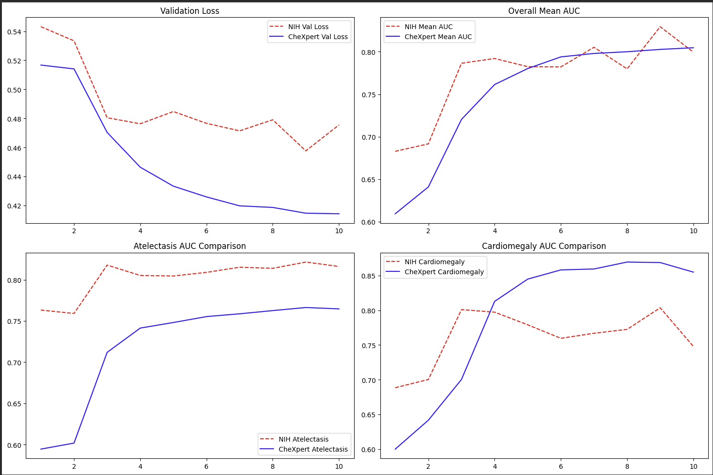

- ct
    - ct : https://www.kaggle.com/competitions/rsna-2023-abdominal-trauma-detection
    - ct 전처리 : https://www.kaggle.com/datasets/yoodeoksu/rsna-2023-atd-preprocessed-s128
    - ct 전처리 : https://www.kaggle.com/datasets/yoodeoksu/rsna-2023-atd-preprocessed-s224
    - 학습 코드_1 : ct-convnext-tiny-s128.ipynb
        - 2 에포크 동결, 증강, any_injury 가중치 처리
        - 7에포크 부터 이어서 처리, 옵티마이저 초기화
        - 14에포크 부터 이어서 처리, 옵티마이저 초기화
        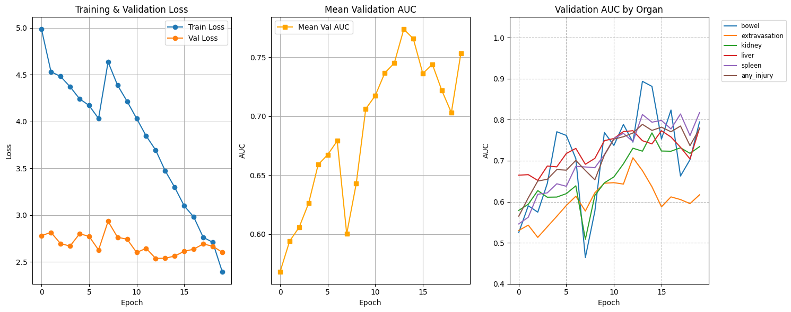
    - 학습 코드_2 : ct-convnext-tiny-s128_2.ipynb
        - 10 에포크 동결, lr = 1e-4 -> 1e-5, weight_decay = 1e-4(고정) 변경
        
    - 학습 코드 3 : ct-convnext-tiny-s128_3.ipynb
        - .pkl 파일은 로그 확인하고 복원...
        - 에포크 0~5 head 동결해제, 6~10 backbone 동결, 11~ backbone 동결 해제
        - lr = 1e-4 -> 1e-5, weight_decay = 1e-4(고정) 변경
        - position, transformer 추가
        - ### Model Architecture
            ```
                ==========================================================
                [입력 데이터] (Batch, 64 Slices, 3, 128, 128)
                ==========================================================
                    ↓
                ==========================================================
                1. [Backbone: ConvNeXt-Tiny] -> "시각 신경 (이미지 스캐너)"
                - 64장의 슬라이스를 각각 스캔하여 1024차원의 특징 추출
                - (64, 3, 128, 128) -> (64, 1024)
                ==========================================================
                    ↓
                ==========================================================
                2. [Position Embedding] -> "인덱스 부여 (공간 좌표)"
                # - 각 특징에 "이건 1번(머리), 이건 64번(골반)"이라는 위치 정보 주입
                ==========================================================
                    ↓
                ==========================================================
                3. [Transformer Encoder] -> "종합 분석 (슬라이스 간 대화)"
                - 64장의 특징들이 서로 정보를 교환하며 전후 맥락 파악
                - "5번 슬라이스의 상처가 10번까지 이어지네? 큰 부상이다!"
                ==========================================================
                    ↓
                ==========================================================
                4. [Attention Pooling] -> "심사위원 (결정적 증거 포착)"
                - 64장 중 가장 수상한(부상이 의심되는) 슬라이스에 높은 점수 부여
                - 64개의 특징을 단 1개의 '필살기 특징 벡터'로 압축 (1, 1024)
                ==========================================================
                    ↓
                ==========================================================
                5. [Final Heads] -> "전문의 진단 (최종 판단)"
                ┌───────────────────────┐
                ▼                       ▼                   
                [suspicion_head]       [organ_heads]
                "응급의학과 의사"       "전문의 진단"
                (전체 부상 유무)        (장기별 정밀 진단)
                ==========================================================
            ```
            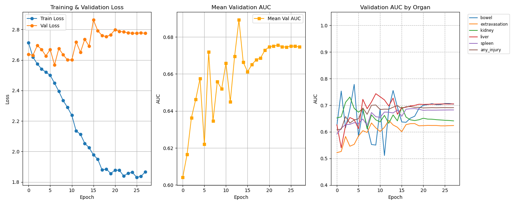
    - 학습 코드 4 : ct-convnext-tiny-s128_4.ipynb
        - v3에서 성능의 한계를 보고 구조를 바꿈(부상 여부를 더 적극적으로 활용)
        - forward 구조 변경(부상 확률에 영향을 받도록 처리)
        - 부상을 여부에 따라 성능의 차이가 많이 달라짐
        - 부상을 당하지 않았는데 Bowel, Liver, Kidney, Spleen에서 부상이 있다고 할 수 있는것을 방지
        - ### Model Architecture
            ```
                ==========================================================
                [입력 데이터] (Batch, 64 Slices, 3, 128, 128)
                ==========================================================
                    ↓
                ==========================================================
                1. [Backbone: ConvNeXt-Tiny] -> "시각 신경 (이미지 스캐너)"
                - 64장의 슬라이스를 각각 스캔하여 768차원의 특징 추출
                - (64, 3, 128, 128) -> (64, 768)
                ==========================================================
                    ↓
                2. [Position Embedding] -> "인덱스 부여 (공간 좌표)"
                - 각 특징에 "이건 1번(머리), 이건 64번(골반)"이라는 위치 정보 주입
                ==========================================================
                    ↓
                3. [Transformer Encoder] -> "종합 분석 (슬라이스 간 대화)"
                - 64장의 특징들이 서로 정보를 교환하며 전후 맥락 파악
                - "5번 슬라이스의 상처가 10번까지 이어지네? 큰 부상이다!"
                ==========================================================
                    ↓
                4. [Attention Pooling] -> "심사위원 (결정적 증거 포착)"
                - 64장 중 가장 수상한(부상이 의심되는) 슬라이스에 높은 점수 부여
                - 64개의 특징을 단 1개의 '필살기 특징 벡터'로 압축 (1, 768)
                ==========================================================
                    ↓
                ==========================================================
                5. [suspicion_head] -> "응급의학과 의사" (전체 부상 유무 판단)
                - [부상 확률 (injury_prob)] (0.0 ~ 1.0)
                ==========================================================
                    ↓
                ==========================================================
                [organ_heads] -> "전문의 진단 (최종 판단)"
                - Bowel, Liver, Kidney, Spleen 등 정밀 진단
                - 부상 확률을 곱하기 때문에 부상에 결과에 영향을 받음
                ==========================================================
            ```
            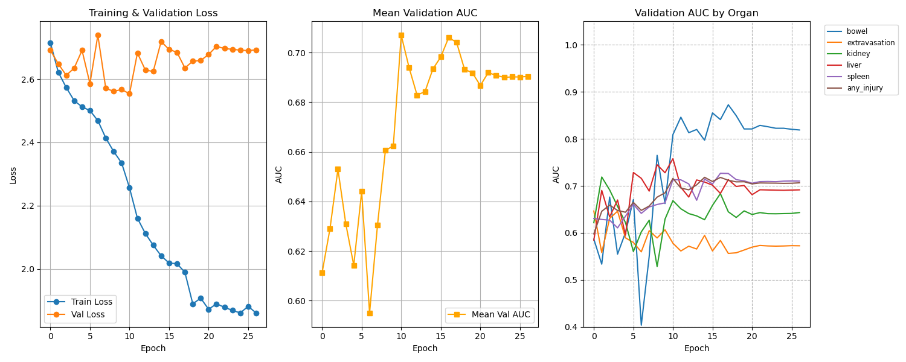
        - best 11 에포크
    - 학습 코드 5 : ct-convnext-tiny-s224_5.ipynb
        - 크기 224로 변경
        - 13에포크 부터 이어서 처리
        - 15에포크 부터 이어서 처리
        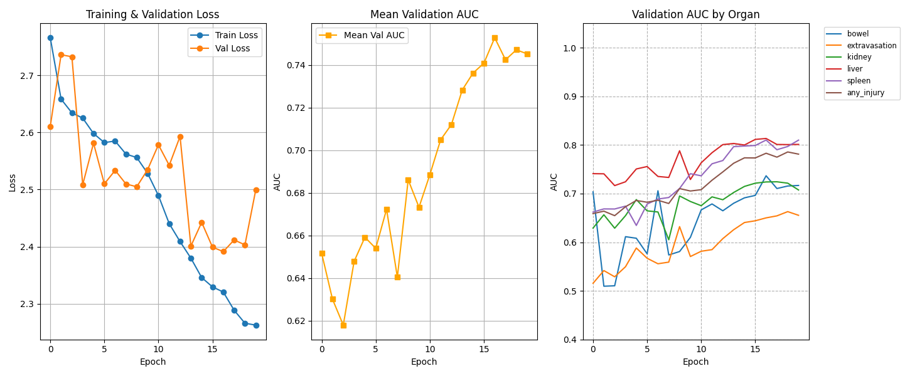


    - 학습 코드 6 : ct-convnext-tiny-s224_6.ipynb
        - 가중치 변경
            ```
            criterion_dict = {
                'bowel': nn.CrossEntropyLoss(weight=torch.tensor([1.0, 10.0]).to(DEVICE), label_smoothing=0.05),
                'extravasation': nn.CrossEntropyLoss(weight=torch.tensor([1.0, 10.0]).to(DEVICE), label_smoothing=0.05),
                'any_injury': nn.CrossEntropyLoss(weight=torch.tensor([1.0, 10.0]).to(DEVICE), label_smoothing=0.05),
                'liver': nn.CrossEntropyLoss(weight=torch.tensor([1.0, 3.0, 5.0]).to(DEVICE), label_smoothing=0.05),
                'kidney': nn.CrossEntropyLoss(weight=torch.tensor([1.0, 3.0, 5.0]).to(DEVICE), label_smoothing=0.05),
                'spleen': nn.CrossEntropyLoss(weight=torch.tensor([1.0, 3.0, 5.0]).to(DEVICE), label_smoothing=0.05),
            }
            ```
        - 12에포크 부터 이어서 처리
        - 15에포크 부터 이어서 처리
        - 18에포크 부터 이어서 처리
        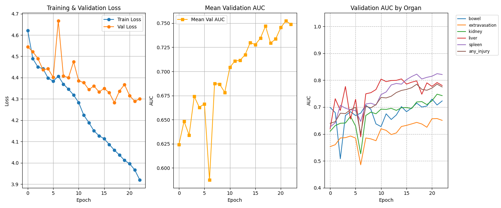 
        - 에포크 22까지 확인 했을 때 더 진행을 해도 큰 차이가 나지 않을것이라 판단 하여 캐글에 올려서 확인
        
    
    - 학습 코드 7 : ct-convnext-tiny-s224_7.ipynb
        - Backbone 동결해제, 전체 동결 해제 조건에서 v6버전에서 optimizer, scheduler 재 설정하니 loss가 튀어 제거하고 이어서 하는 방식으로 변경
        - CrossEntropyLoss label_smoothing = 0.1 변경으로 모델이 너무 확신하지 않게
        - AdamW weight_decay=0.01 추가
        - 외곡을 덜 시키기 위해 RandGridDistortiond 제거
        - dropout= 0.3 변경
        - accumulation_steps = 8 추가
        - 코드 구조 기존 학습하던 모델 불러오는 방식 코드 수정
        - epoch 12-14 이어서 학습
        - epoch 15-23 이어서 학습
        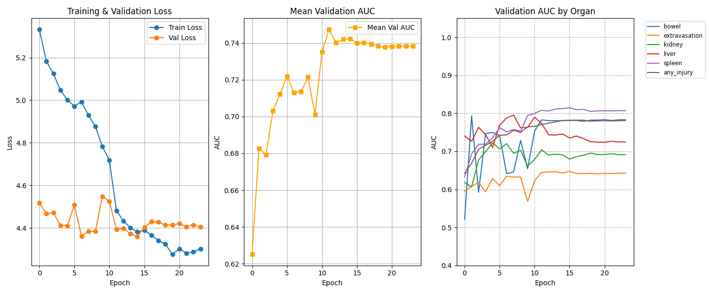
        - 캐글 결과 확인
        
    
    - 학습 코드 8 : ct-convnext-tiny-s224_8.ipynb
        - 증강 모두 제거, dropout=0.1 변경
        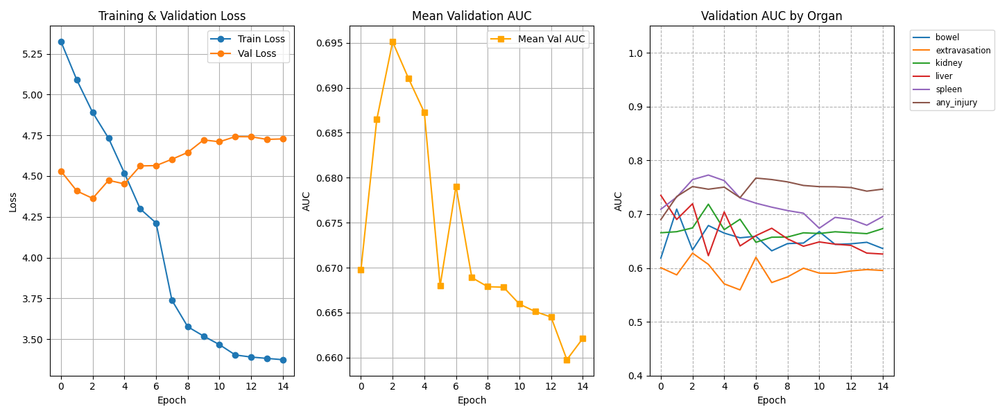
        - loss, auc 모두 좋지 않음
    
    - 학습 코드 9 : ct-convnext-tiny-s224_9.ipynb
        - 증강 모두 복구
        - convnext_tiny모델에서 추천해준 lr 전략
            - LLRD전략 : Backbone과 Head의 학습률(LR)을 다르게 설정
            
            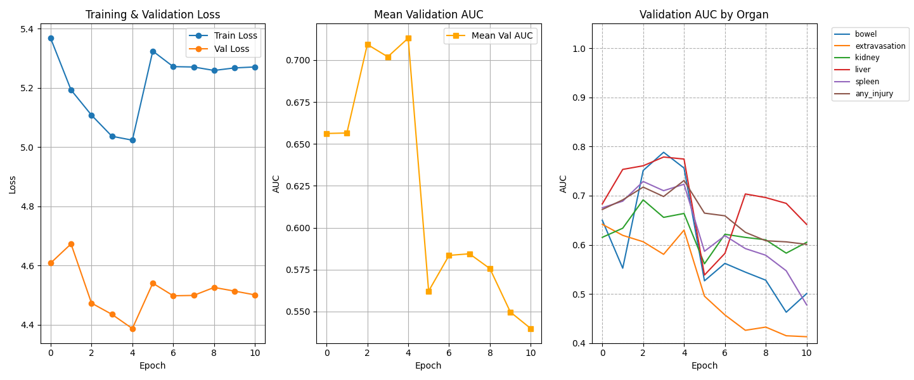
    
    - 학습 코드 10 : ct-convnext-tiny-s224_10.ipynb
        - README.md를 정리하다 v1이 가장 auc가 잘나와서 224 크기로 처음에 진행했던 코드로 다시 동작
        - v10까지 결과중 가장 잘나옴 0.775를 넘겼네?
        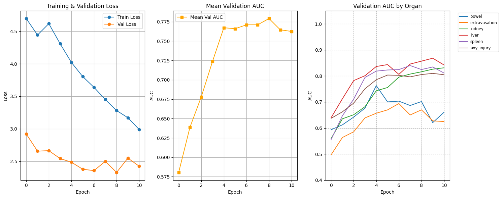

    - 학습 코드 11 : ct-convnext-tiny-s224_11.ipynb
        - 버전 10에서 부상만 가지고 판단하는 학습 진행
        - 병명이까지 파단이 아닌 부상이 있다 없다면 체크
        - 부상이 있다/없다 만 판단을 하기 때문에 0.8을 넘겼다?
        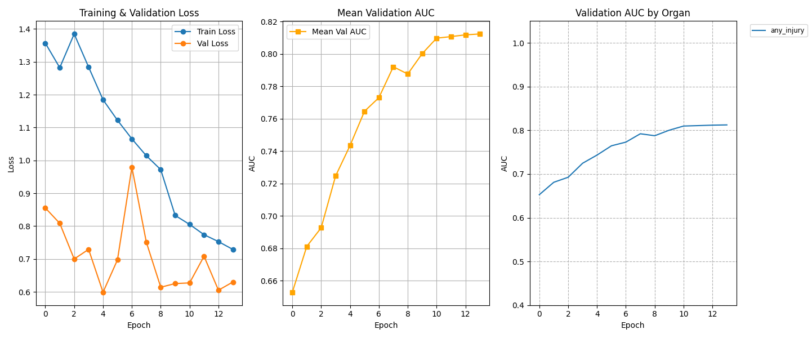
    
    - 학습 코드 12 : ct-convnext-tiny-s224_12.ipynb
        - CrossEntropyLoss 에서 BCEWithLogitsLoss만 바꿈