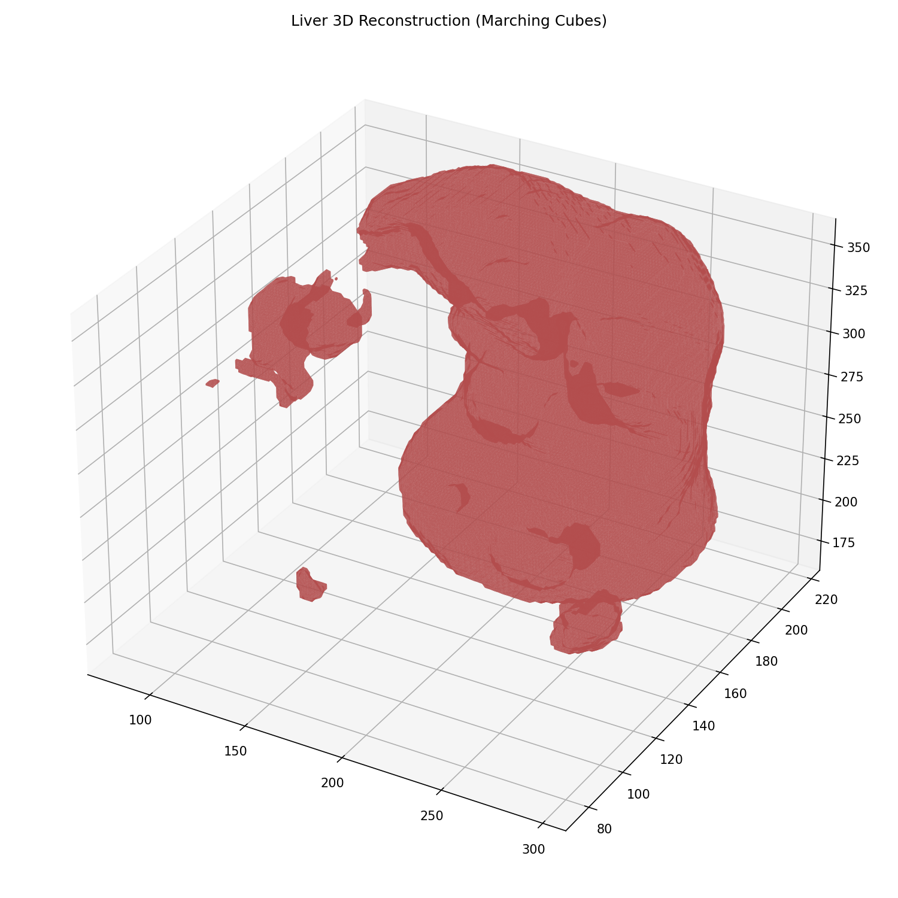
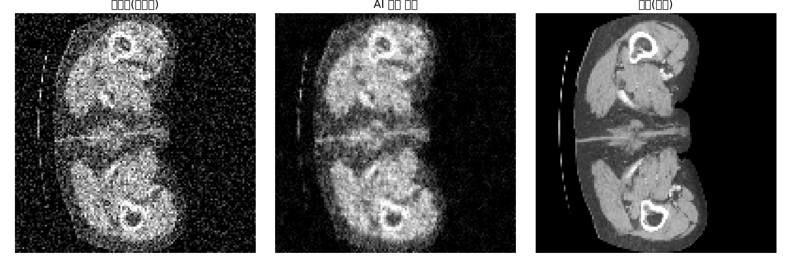

# 의료영상 AI 프로젝트

복부 CT 외상 진단(RSNA 2023 Abdominal Trauma Detection 데이터·채점 기준
활용)과, 같은 복부 CT를 재사용한 segmentation·3D reconstruction·denoising 작업을
모은 저장소. 자가건강체크 RAG 챗봇 프로젝트([../llm/README.md](../llm/README.md))의
텍스트 기반 접근과 달리, 여기서는 실제 의료 영상(CT)을 입력으로 다룬다
(전체 포트폴리오 구성은 [최상위 README](../README.md) 참고).

## 설계 철학: "확진"이 아니라 "의심"

이 저장소의 모델들이 최종적으로 맞히려는 건 "정확한 병명"이 아니라 **"이상이
있는가, 정밀 검사가 더 필요한가"**다. 동네 병원 의사가 "이게 정확히 무슨
병인지"까지는 몰라도 "뭔가 이상한데, 큰 병원 가서 정밀 검사 받아보세요"
한마디로 놓칠 뻔한 문제를 잡아내는 것처럼, 이 모델들의 목표도 의사가 판독 중
놓칠 수 있는 부분을 한 번 더 짚어주는 **1차 스크리닝**이다. 그래서 이 판단
기준은 병명별 정밀도(precision)보다 **놓치지 않는 것(recall/민감도)**에 있다
— 오탐(false positive)은 불필요한 정밀 검사 한 번으로 끝나지만, 놓침(false
negative)은 치료 시기를 놓치는 문제로 이어질 수 있기 때문이다. 아래 1절의
"3단계 임상 파이프라인" 중 **1단계 Screening("손상 유무")이 이 저장소 전체의
핵심 결과**이고, 장기별 세부 분류는 스크리닝 이후의 부가 정보로 본다.

## 왜 RSNA(1절) 외에 LiTS(2절)도 같이 있는가

### LiTS를 추가한 이유

채용 공고를 조사해보면 의료영상 AI 엔지니어 포지션은 classification 외에
**segmentation·3D reconstruction·image-to-image translation**을 반복적으로
요구한다. 그런데 1절(RSNA)은 "장기가 다쳤나/안 다쳤나"를 분류하는
classification 태스크뿐이라, 이 gap을 메우려면 새로운 태스크(그리고 보통
그에 맞는 새 데이터셋)가 필요했다. 그래서 **같은 복부 CT를 재사용하되
태스크만 확장**하기로 하고 LiTS를 골랐다 — 자세한 선정 근거(왜 하필 LiTS인지,
왜 MSD가 아닌지)는 2절 도입부에 있다.

### LiTS만으로 하지 않고 RSNA를 같이 가져가는 이유

세그멘테이션 하나만 있어도 채용 공고의 기술 요구사항 자체는 채울 수 있지만,
RSNA를 같이 유지하는 데는 LiTS가 대체할 수 없는 가치가 따로 있다:

- **Kaggle 채점 시스템으로 실측한 기록**: RSNA 2023 Abdominal Trauma
  Detection 데이터로 학습한 뒤 Kaggle 채점 시스템에 제출해 점수를 실측한
  기록(1절 "Kaggle 제출 결과")이 있다 — 다만 대회 마감 후 제출이라 공식
  대회 참가나 리더보드 순위는 아니고, 어디까지나 "실제 대회 데이터·채점
  기준으로 자체 검증"한 것이다. 그래도 LiTS는 이런 외부 채점 시스템에
  올려본 적조차 없다는 점에서, RSNA 쪽이 상대적으로 더 외부화된 검증
  신호를 갖고 있다.
- **18개 버전을 반복 실험하며 개선한 엔지니어링 과정 자체가 증거물**이다
  (1절 "버전별 요약" 표) — 데이터·구조·하이퍼파라미터를 바꿔가며 무엇이
  실제로 성능에 영향을 주는지 실측으로 검증해온 이력은, 단발성 학습인
  LiTS로는 보여줄 수 없는 별개의 역량이다.
- **완전히 다른 태스크 종류(classification vs segmentation)에 같은 방법론을
  일관되게 적용**한 것 자체가 하나의 증거다 — RSNA(v11)에서 검증한 "확진이
  아니라 의심"(recall 우선 재평가) 철학을, 성격이 다른 LiTS의 segmentation
  케이스 단위 recall에도 동일하게 적용했다(2절). 하나만 있었으면 "이 철학이
  이 태스크에서만 우연히 통했다"로 보일 수 있는데, 서로 다른 태스크 둘에서
  같은 결론이 나오면 방법론 자체의 일반성을 보여준다.
- RSNA는 이미 950건 실측(recall-오탐 표, 1절)까지 끝난 완결된 결과물이라,
  이걸 버리고 LiTS 하나로 단순화하면 검증된 자산을 버리는 셈이 된다.
- **데이터 다양성**: RSNA(외상 환자 CT, 여러 기관)와 LiTS(간전이 항암치료
  환자 CT, 여러 병원)는 환자군도 촬영 목적도 서로 다른 별개의 실전 데이터다.
  하나의 데이터셋에서만 "지저분한 실전 데이터에서도 성능이 나온다"고
  주장하면 그 데이터 하나의 특성에 우연히 맞았을 가능성을 배제할 수 없지만,
  서로 다른 두 데이터에서 같은 방식(messy real-world data, recall 우선
  평가)이 반복적으로 통하면 그 방법론이 특정 데이터에 우연히 맞은 게 아니라
  일반적으로 적용 가능하다는 근거가 더 튼튼해진다.

정리하면: **LiTS는 기술 스택의 폭(segmentation/3D/denoising)을 채우기
위한 추가**이고, **RSNA는 실제 대회 데이터·채점 기준 실측·반복 개선·이미
검증된 결과라는, LiTS로 대체 불가능한 신뢰도를 위해 유지**한다. 폭은
LiTS가, 깊이와 신뢰도는 RSNA가 맡고, **둘을 같이 가져감으로써 서로 다른
데이터에서도 같은 방법론이 통한다는 데이터 다양성까지 확보**하는 구조다.

## 1. 복부 CT 외상 진단 (RSNA 2023 Abdominal Trauma Detection)

`experiments/ct-convnext-tiny-s224_11.ipynb` (Screening 채택 버전),
`experiments/ct-convnext-tiny-s224_17.ipynb` (Organ Diagnosis 채택 버전),
`experiments/ct-convnext-tiny-s224_19.ipynb` (Screening 개선 실험, 진행 중),
`experiments/ct_train_preprocess_*.ipynb`, `experiments/ct_show_history.py`

Kaggle 의료영상 대회(RSNA 2023 Abdominal Trauma Detection) 데이터로 학습하고
채점 시스템에 제출까지 해본 코드(마감 후 제출이라 공식 참가는 아님).
장(bowel), 혈관외유출(extravasation), 간(liver), 신장(kidney), 비장(spleen)
5개 장기의 손상 여부/등급을 CT로 진단하는 문제. v1~v18까지 총 18개 버전을
실험했고, 각 버전의 학습 기록(`assets/monai_ct_convnext_v*.pkl`,
`assets/버전별 수정 사항.md`)을 전부 실측 비교해서 최종적으로 **v11
(Screening)과 v17(Organ Diagnosis)**을 채택했다 — 아래에 그 선정 근거를
그대로 남겨둔다.

### 아키텍처

- **백본**: ConvNeXt-tiny (timm), ImageNet 사전학습 후 동결(freeze)
- **Attention Pooling**: 환자 한 명당 CT 슬라이스가 여러 장이라, 슬라이스별
  특징을 단순 평균이 아니라 **학습 가능한 attention 가중치로 합산**해서 중요한
  슬라이스에 더 집중하도록 설계
- **3단계 임상 파이프라인**, 이 중 **1단계가 이 프로젝트의 핵심**:
  1. **Screening (v11)** — "손상이 있는가/없는가"만 판정하는 이진 스크리닝.
     "정확한 병명"이 아니라 "이상 소견이 있으니 다음 단계로 넘겨야 하는가"만
     판단한다는 점에서, 위에서 밝힌 "확진이 아니라 의심" 철학이 그대로 구현된
     단계.
  2. **Organ Diagnosis (v17)**: 스크리닝을 통과한 케이스에 한해 5개 장기별
     손상 등급까지 세분화 진단 (장기별로 다른 출력 클래스 수 —
     bowel/extravasation은 2클래스, liver/kidney/spleen은 3클래스). 이건
     "어떤 병인가"를 다루는 2차 정보로, 스크리닝보다 우선순위가 낮다.
  3. **Verification**: 2단계 결과 중 최고 확률이 임계값을 넘어야 최종 "손상"
     판정 — 스크리닝에서 걸러진 것만 정밀 진단하는 임상 워크플로우를 모사
- **MONAI**(Medical Open Network for AI) — 의료영상 전용 프레임워크로 3D CT
  로딩·전처리·데이터 파이프라인을 구성

### v11 구현 (PyTorch)

```python
class Timm_Model(torch.nn.Module):
    def __init__(self, model_name='convnext_tiny', num_slices=64):
        super().__init__()
        self.backbone = timm.create_model(model_name, pretrained=True, num_classes=0)
        self.dim = self.backbone.num_features  # ConvNeXt-tiny 기준 768

        # Attention Pooling: 64장 중 수상한 슬라이스를 골라내는 '심사위원'
        self.attention_net = nn.Sequential(
            nn.Linear(self.dim, 256), nn.Tanh(), nn.Dropout(0.1), nn.Linear(256, 1)
        )
        # Suspicion Head: "부상 여부 탐지" 전용 헤드
        self.suspicion_head = nn.Sequential(
            nn.Linear(self.dim, 256), nn.LayerNorm(256), nn.ReLU(),
            nn.Dropout(0.1), nn.Linear(256, 2)  # [정상, 부상] 확률
        )

    def forward(self, x):  # x: (Batch, 64, 3, 224, 224)
        b, s, c, h, w = x.shape
        features = self.backbone(x.view(-1, c, h, w)).view(b, s, self.dim)
        att_weights = F.softmax(self.attention_net(features), dim=1)
        combined = torch.sum(features * att_weights, dim=1)  # (B, 768)
        return {"any_injury": self.suspicion_head(combined)}
```

**Class Imbalance Handling**: 손실 함수에 높은 가중치(`injury_weight =
[1.0, 5.0]`)를 부여해 부상 환자를 놓치지 않도록(recall 우선) 설계 — 이
project 전체의 "확진이 아니라 의심" 철학이 손실 함수 설계 단계부터 이미
반영돼 있었다.

### 버전별 요약 (v1~v17, 전체 실험 이력)

| Version | Image Size | Best Epoch | Best AUC | 요약 |
|:---|:---:|:---:|:---:|:---|
| v1_2 | 128×128 | 13 | 0.7738 | Baseline. 2 epoch 동결, any_injury 가중치 손실함수 |
| v2 | 128×128 | 9 | 0.6793 | 10 epoch 장기 동결 실험 — 학습 속도 저하 확인 |
| v3 | 128×128 | 13 | 0.6892 | Transformer Encoder 도입 시도 |
| v4 | 128×128 | 10 | 0.7070 | Gating 구조 도입(부상 확률을 장기 헤드에 곱함) |
| v5_2 | 224×224 | 16 | 0.7529 | 해상도 상향, 성능 비약적 상승 |
| v6_4 | 224×224 | 21 | 0.7524 | 장기별 가중치 + label smoothing |
| v7 | 224×224 | 11 | 0.7474 | Gradient accumulation + 규제 강화 |
| v8 | 224×224 | 2 | 0.6951 | augmentation 완전 제거 — 성능 폭락(강건성 반증) |
| v9 | 224×224 | 4 | 0.7131 | augmentation 복구 + **LLRD 최초 도입** |
| v10 | 224×224 | 8 | 0.7791 | 고해상도 attention 최적화 |
| **v11** | 224×224 | 13 | **0.8124** | **부상 유무 판별에만 집중 — 최고 성능** |
| v12 | 224×224 | 10 | 0.8047 | BCEWithLogitsLoss 전환 실험 |
| v13 | 224×224 | 8 | 0.7842 | Transformer 재도입 — 단순화 버전 대비 효율 한계 확인 |
| v14_2 | 224×224 | 39 | 0.7660 | EMA + Stochastic Depth + Warm Restart |
| v15 | 224×224 | 39 | 0.7843 | 규제 최적화 + EMA, 가장 안정적인 검증 곡선 |
| v16 | 224×224 | 39 | 0.7754 | LLRD 제거 실험 — v15 대비 하락, LLRD 효과 검증 |
| v17 | 224×224 | 29 | 0.7182 | Organ Diagnosis 특화(any_injury 제거, 5장기 진단) |

버전별 상세 변경 사항은 `assets/버전별 수정 사항.md`에 전부 남아있다.

### DICOM 전처리 (`ct_train_preprocess_1.ipynb`)

모델에 들어가기 전, 원본 DICOM을 직접 파싱하는 단계 — 전처리된 배열이 아니라
`pydicom`으로 실제 DICOM 파일을 다룬 경험을 명시적으로 남겨둔다:

- **유효성 검사**: `pydicom.dcmread`로 읽은 뒤 `pixel_array` 디코딩을 실제로
  시도해서 손상된 슬라이스를 사전에 걸러냄
- **해부학적 순서 정렬**: `ImagePositionPatient`의 Z좌표 기준으로 슬라이스를
  정렬(파일명 순서가 실제 인체 위치 순서와 다를 수 있기 때문)
- **HU(Hounsfield Unit) 변환**: `pixel_array * RescaleSlope + RescaleIntercept`
  — DICOM의 raw pixel 값은 그 자체로 의미가 없고, 이 변환을 거쳐야 실제 조직
  밀도를 나타내는 CT 표준 단위(HU)가 됨
- **물리적 spacing 반영**: `PixelSpacing`/`ImagePositionPatient` 간격으로 실제
  볼륨의 3D affine 행렬을 계산해 MONAI `MetaTensor`로 구성 — 픽셀 간격이 아니라
  실제 mm 단위 해부학적 비율을 보존
- **외상 특화 3-채널 윈도잉**: 같은 HU 볼륨을 서로 다른 HU 구간 3개로 각각
  잘라 하나의 3채널 이미지로 합침 — Soft Tissue(-160~240, 장기 손상용),
  Angio/Blood(-250~450, 활성 출혈 강조), Bowel/Air(-300~200, 장 천공 가스
  강조). 단순히 CT를 흑백 이미지 하나로 보는 게 아니라, 외상 진단에 실제로
  중요한 3가지 소견이 각각 잘 보이도록 HU 윈도우를 나눠 채널로 구성한 것.

### 결과 (`assets/monai_ct_convnext_v*.pkl` 18개 전부 실측 비교)

| 모델 | 최종 성능 (mean AUC) | 비고 |
|---|---|---|
| **v11 (Screening — 핵심 결과)** | **0.8124** (epoch 14/17) | "손상 유무"만 판정하는 이 저장소의 핵심 지표 |
| v17 (Organ Diagnosis — 부가 정보) | **0.718** | 장기별: bowel 0.736 / extravasation 0.604 / liver 0.771 / kidney 0.718 / spleen 0.762 |

**왜 v15가 아니라 v11인가**: 처음엔 40 epoch을 돌린 v15(최종 AUC 0.784)를
Screening 모델로 썼는데, 18개 버전의 학습 기록을 다시 읽어보니 v11이 **17
epoch만에 0.8124로 이미 수렴**한 반면 v15는 40 epoch을 다 채우고도 AUC가
계속 오르는 중(수렴 전)이었다. 원본 실험 기록(`assets/버전별 수정 사항.md`)을
보면 이 차이의 실제 원인도 확인된다 — v15는 Transformer Encoder +
Positional Encoding + 장기별 heads(organ_heads)까지 얹은 복잡한 구조였던
반면, v11은 그 모든 걸 걷어내고 **장기별 라벨 없이 "부상 유무" 하나만
판단**하도록 아키텍처를 단순화한 버전이다 — "복잡한 멀티태스크 구조보다,
목적에 맞게 단순화한 단일 태스크 구조가 이 문제에서는 더 잘 맞았다"는
것. 순수하게 실측 AUC가 더 높고 이미 수렴까지 끝난 v11로 교체했다. (v10도
0.8099로 근접했지만, v10은 장기별 진단까지 한 번에 묶은 멀티태스크
모델이라 "Screening 단독" 역할에는 v11이 더 적합하다고 판단)

**v19 실험(진행 중)**: v11의 학습 코드에는 `LAYER_DECAY = 0.8`이라는
변수가 선언만 되고 실제로는 안 쓰이고 있었다 — 이건 v11이 v15를 이긴
"원인"은 아니고(원인은 위의 구조 단순화), 더 복잡했던 v13~16 계열에서
쓰던 설정이 단순화된 v11 스크립트에 흔적만 남은 것이었다. 다만 원본
기록을 보면 **v16이 "LLRD(Layer-wise LR Decay) 제거 실험"을 한 결과
v15(0.7843)보다 낮은 0.7754가 나왔다는, 원작자가 이미 검증해둔 근거가
있다** — 즉 이 문제에서 LLRD 자체는 실제로 도움이 되는 기법이었다는 것.
그래서 "이미 v15보다 나은 v11 구조에, 검증된 LLRD까지 실제로 적용하면
한 단계 더 개선되는가"를 확인하는 v19 실험을 별도로 진행 중이다
(`ct-convnext-tiny-s224_19.ipynb`).

**장기별로 난이도 차이가 뚜렷하다** — extravasation(활동성 출혈)은 0.604로
가장 낮은데, 이건 영상만으로 활동성 출혈을 잡아내는 게 실제 방사선의학에서도
어려운 소견으로 꼽히는 것과 일치한다.

### recall 우선 재평가 (`ct_screening_inference.py` + `screening_eval.py`, 950개 검증 케이스 실측)

AUC는 임계값에 무관한 전반적 판별력이라, "확진이 아니라 의심" 철학을 실제
운영 관점에서 증명하려면 "특정 recall을 유지하려면 오탐을 얼마나 감수해야
하는가"를 봐야 한다. v11 가중치로 검증셋 950건을 Kaggle GPU(T4 x2)에서
다시 추론해서 뽑은 결과:

| 목표 recall | threshold | 실제 recall | 오탐률(FPR) | precision |
|---|---|---|---|---|
| 0.90 | 0.2335 | 0.903 | 0.544 | 0.419 |
| 0.95 | 0.1682 | 0.951 | 0.692 | 0.374 |
| 0.99 | 0.1031 | 0.993 | 0.885 | 0.328 |

**솔직한 해석**: recall을 90%로만 잡아도 오탐률이 54.4%다 — 정상인 사람
중 절반 이상이 "정밀 검사 필요"로 잘못 분류된다는 뜻. recall 99%까지
올리면 오탐률이 88.5%까지 치솟아서, 거의 모든 사람을 "의심"으로 분류하는
셈이 되어 실효성이 떨어진다. 즉 "확진이 아니라 의심"이라는 설계 방향은
맞지만, **지금 v11 모델의 판별력만으로는 recall을 크게 희생하지 않고
오탐을 낮게 유지하기 어렵다**는 것도 같이 드러난 솔직한 한계다 — AUC
0.8124는 "임계값 하나 골라서 쓰기엔" 아직 불안정한 수준이라는 뜻이기도
하다. 그래서 실제 배포 시 임계값은 **recall 90%(오탐 54%) 지점**을
잠정 채택했다 — recall 99% 지점은 거의 전원 플래그라 스크리닝 도구로서
의미가 없다고 판단했기 때문. `serve/app.py`의 `SUSPICION_THRESHOLD`를
0.2335로 반영했다.

**v15로도 같은 방식으로 재평가해서 비교해봤다** — AUC로 봤던 "v11이 v15보다
낫다"는 결론이 recall-오탐 관점에서도 그대로 재확인됨(같은 recall을
유지하는 데 v15가 항상 더 많은 오탐을 낸다):

| 목표 recall | v11 오탐률 | v15 오탐률 | v11 precision | v15 precision |
|---|---|---|---|---|
| 0.90 | **0.544** | 0.662 | **0.419** | 0.372 |
| 0.95 | **0.692** | 0.810 | **0.374** | 0.338 |
| 0.99 | **0.885** | 0.906 | **0.328** | 0.323 |

**방법론적 한계**: 위 수치들은 전부 v11 학습 때 이미 "검증셋"으로 썼던
그 950명(train_test_split random_state=42, 20%)을 그대로 재사용해서 (1)
어떤 epoch이 최선인지 고르고 (2) threshold를 고르고 (3) 그 threshold의
recall/오탐률을 채점하는 데까지 전부 같은 데이터를 썼다 — 즉 val로
고른 기준을 val로 다시 채점한 셈이라, 실제보다 낙관적일 위험이 있다.
정직하게 하려면 이 950명을 다시 val/test로 쪼개 test는 threshold 선택에
전혀 관여하지 않게 해야 하는데, 아직 안 했다.

### Kaggle 제출 결과

`assets/monai_ct_convnext_v6_2_ep17 submission.png`, `..._v7_ep15 submission.png`

| 버전 | Private Score | Public Score |
|---|---|---|
| v6_2 (ep17) | 0.624 | 0.633 |
| v7 (ep15) | 0.640 | 0.656 |

**둘 다 "Succeeded (after deadline)"** — 대회 마감 이후 제출이라 공식
리더보드 순위는 없다. 그래서 이 점수 자체를 "몇 등"으로 환산할 근거는 없고,
정직하게 "마감 후 자체 채점"으로만 제시한다.

## 2. 복부 CT Segmentation / 3D Reconstruction / Denoising

`experiments/ct_organ_segmentation.py`, `experiments/ct_3d_reconstruction.py`,
`experiments/ct_denoising.py`

위의 RSNA CT 외상 진단이 "장기가 다쳤나/안 다쳤나"를 분류(classification)만
했다면, 여기서는 같은 복부 CT 문제를 3가지 다른 태스크로 확장했다. 채용 공고
리서치 결과 의료영상 AI 엔지니어 포지션들이 classification 외에
segmentation·3D reconstruction·image-to-image translation을 반복적으로
요구해서, 그 3가지 gap을 메우는 작업이다.

데이터셋은 **LiTS(Liver Tumor Segmentation, MICCAI 2017 챌린지)** — Kaggle에
`andrewmvd/liver-tumor-segmentation`(Part 1) + `andrewmvd/liver-tumor-
segmentation-part-2`(Part 2)로 나뉘어 올라와 있다. 처음엔 Medical
Segmentation Decathlon(MSD) Task09_Spleen(단일 기관에서 전문의가 깨끗하게
재검수한 데이터)으로 시작했었는데, **"정제된 데이터에서 좋은 성능을 내는 건
누구나 할 수 있고, 지저분한 실전 데이터에서 성능을 뽑아내는 게 진짜 차별화
포인트"**라는 방향으로 바꿔 LiTS로 교체했다. LiTS는 여러 병원에서 모은 CT라
슬라이스 두께(0.45~6mm)와 스캐너 프로토콜이 제각각인 실전형 데이터라는 점이
RSNA(여러 기관의 실제 외상 CT)를 선택한 이유와 같은 맥락이다. 간(liver)은
RSNA에서 이미 다룬 5개 진단 장기 중 하나라서, "RSNA: 간 손상 분류 → LiTS:
간+종양 분할"로 같은 장기를 다른 태스크로 확장하는 서사도 자연스럽게
이어진다. 라벨은 배경/간/종양 3-class로, spleen(2-class)보다 한 단계 어려운
문제다.

- **Segmentation** (`ct_organ_segmentation.py`): MONAI `SegResNet`으로 간+종양을
  복셀(voxel) 단위로 분할. `DiceLoss`/`DiceMetric`으로 학습·평가, ROI
  (96,96,96), 30 epoch. "경계를 얼마나 정확히 그렸는가"(Dice)와 별개로
  **케이스(환자) 단위로 종양 유무를 놓치지 않았는가(case-level recall)**도
  매 epoch마다 같이 계산하도록 넣어둠 — CT(v11)와 같은 "확진이 아니라
  의심" 관점을 segmentation 태스크에도 일관되게 적용.
- **3D Reconstruction** (`ct_3d_reconstruction.py`): 위에서 학습한
  segmentation 모델의 예측 마스크(2D 슬라이스가 쌓인 볼륨)에 **Marching
  Cubes** 알고리즘(고전 알고리즘, `skimage.measure.marching_cubes`)을 적용해
  간의 실제 3D 표면(mesh)으로 복원. 앞 단계 결과를 그대로 이어받아 쓰기 때문에
  추가 데이터가 필요 없다.
- **Denoising / Image-to-image translation** (`ct_denoising.py`): 정답
  저선량/고선량 CT 쌍 데이터(AAPM-Mayo)는 별도 신청 절차가 있어 접근이 번거로워,
  대신 **자기지도학습(self-supervised)** 방식을 택함 — 같은 LiTS CT에
  포아송+가우시안 노이즈를 인위적으로 씌워 저선량 CT를 흉내내고, 이를 다시
  원본으로 복원하도록 2D `UNet`(MONAI)을 학습. PSNR로 평가.

### 결과 (Kaggle GPU T4 x2 실측, `ct_lits_pipeline.ipynb`)

| 단계 | 지표 | 실측값 | 비고 |
|---|---|---|---|
| Segmentation | **최고 Dice** | **0.5815** | 30 epoch, 간+종양 평균 |
| Segmentation | **case-level recall** | **1.000** (TP=13, FN=0) | 검증셋 13케이스 종양 전원 탐지 |
| 3D Reconstruction | 복원 메쉬 | 정점 51,305개 / 삼각형 102,594개 | 검증셋 1케이스 |
| Denoising | **최고 PSNR** | **19.70 dB** | 15 epoch |

**Dice 0.58은 낮지 않은가**: LiTS는 여러 병원에서 모은 CT라 슬라이스 두께
(0.45~6mm)와 스캐너 프로토콜이 제각각인 실전형 데이터다. MICCAI 2017 챌린지
상위권이 0.96~0.97 수준이지만, 그건 모델 규모·학습 시간·앙상블 등이 훨씬 크다.
단일 SegResNet 30 epoch 기준으로는 합리적인 출발점이다.

**case-level recall 1.0은 주목할 만하다**: 검증셋 13케이스에서 종양이 있는
케이스를 단 한 건도 놓치지 않았다(FN=0). "확진이 아니라 의심" 철학 — recall
우선 설계가 segmentation 태스크에서도 그대로 나타난 결과다. 다만 검증셋이
13케이스로 작아 통계적 신뢰도는 제한적이다.

**3D Reconstruction 결과** (`assets/liver_3d_reconstruction.png`):



**Denoising 결과** (`assets/ct_denoise_comparison.png`) — 좌: 저선량 노이즈, 중: AI 복원, 우: 원본:



### 실행 환경

세 스크립트 모두 로컬(CPU 전용) 환경에서는 학습이 비현실적이라 **Kaggle/Colab
GPU 실행을 전제로 작성**했다. `.py` 3개는 각 단계의 소스코드이고, 실제
Kaggle 실행용으로는 세 단계를 한 번에 순서대로 돌리는 **통합 노트북
`experiments/ct_lits_pipeline.ipynb`**를 별도로 만들어뒀다 — Kaggle에서
"Add Input"으로 위 두 데이터셋을 추가하고 Accelerator를 GPU T4 x2로 맞춘
뒤 "Run All" 한 번이면 segmentation → 3D reconstruction → denoising이
차례로 다 돌아간다. (라이선스는 CC BY-NC-SA — 비상업적 연구/포트폴리오 용도)

### 상태

Kaggle GPU T4 x2 환경에서 `ct_lits_pipeline.ipynb`를 실행해 실측 수치를 확보했다.
위 결과 섹션에 Dice/PSNR/case-level recall 실측값과 결과 이미지를 기록했다.


## 3. 서빙 데모 (`serve/app.py`)

학습만 하고 끝내는 게 아니라 "학습된 모델을 실제로 서빙해본 경험"을 보여주기
위한 최소 단위 FastAPI 데모. 전체 CI/CD·모니터링까지는 범위 밖이고, RAG
챗봇(`llm/main.py`)과 같은 FastAPI 패턴을 재사용해 포트폴리오 전체의 기술
스택을 통일했다.

- v11(Screening) 가중치(`assets/monai_ct_convnext_v11_ep16.pth`, 로컬에 있음)를
  로드해 전처리된 CT 볼륨(.npy)을 입력받아 "정밀 검사가 필요할 수 있는가"만
  반환 — 정확한 병명이 아니라 "의심" 결과를 그대로 반영한 응답 형식
- `SUSPICION_THRESHOLD`는 950건 실측(1절 "recall 우선 재평가")에서 나온
  recall 90% 지점(0.2335)을 반영함
- 원본 DICOM을 업로드받아 그 자리에서 전처리하는 것까지는 범위 밖(전처리
  자체가 무겁고 RSNA 원본 데이터 없이는 검증도 어려움) — `ct_train_
  preprocess_1.ipynb`로 미리 만든 (3,64,224,224) 볼륨을 입력으로 받는다
- **상태**: 격리된 venv에 torch(CPU)/timm/fastapi/uvicorn을 설치해서 실제로
  서버를 띄우고 확인했다 — v11 체크포인트 로드, `GET /`, `POST /predict`
  (정상 shape 성공/오탐지 검증까지) 전부 에러 없이 동작한다. 단, 로컬에 실제
  RSNA CT 데이터가 없어서 입력은 shape·dtype만 맞춘 **랜덤 노이즈 볼륨**을
  썼다 — 이건 "배관이 안 새는지"(서버 기동, 체크포인트 로드, 업로드→추론→응답
  파이프라인)를 확인한 스모크 테스트이지, "모델이 실제로 잘 맞히는지"를
  검증한 게 아니다. 후자는 1절 "recall 우선 재평가"의 950건 실측이 이미
  맡고 있다.

## 한계와 앞으로 할 일

- **CT(v11, v17) 가중치(.pth)는 로컬에 있지만, 원본 CT 영상 데이터는 없다**
  (RSNA 대회 데이터라 Kaggle 환경에서만 접근 가능) — 그래서 `serve/app.py`도
  전처리된 .npy만 입력받고, 원본 DICOM부터 끝까지 로컬에서 재현하는 건 안 됨.
- CT 파이프라인은 마감 후 제출이라 공식 순위가 없다 — 성능 수치는 실측이지만
  "상대적으로 얼마나 잘한 것인지"는 판단할 외부 기준이 없다.
- 두 작업(1, 2절) 다 아직 [`../llm/` RAG 프로젝트](../llm/README.md)와
  연결되지 않았다. 도메인이 다르다는 점도 고려해야 한다 — CT 외상 진단(장기
  손상)은 RAG의 KDCA 일반 질병 정보와 딱 맞아떨어지진 않아서, 연결하려면
  "영상 소견 → 관련 질환명 매핑" 같은 중간 단계가 필요하다.
- Segmentation/3D reconstruction/denoising(2절)은 코드만 작성된 상태로,
  Kaggle/Colab에서 실행해 실측 수치(Dice/PSNR/case-level recall)를 채우는
  게 남은 작업이다.
- v19(LLRD 실제 적용, 1절 참고)도 아직 Kaggle에서 실행 전이다.
- recall 재평가(1절)는 val/test 미분리 상태의 잠정치다 — 950명을 val/test로
  쪼개 재검증하는 게 남은 작업이다.
- `serve/app.py`는 실제로 기동해서 배관(체크포인트 로드 → 업로드 → 추론 →
  응답)까지 확인했지만, 로컬에 실제 CT 데이터가 없어 랜덤 노이즈 입력으로만
  검증했다 — 실제 CT 볼륨으로 end-to-end를 확인하려면 Kaggle처럼 원본 데이터에
  접근 가능한 환경이 필요하다.

## 회고

- **2.5D 하이브리드 아키텍처 최적화**: 연산량이 큰 3D 모델 대신, ConvNeXt와
  Attention 기법을 결합해 실시간성(latency)과 정확도를 동시에 확보한 경험.
- **최신 기술을 적용한다고 성능이 오르는 것은 아니다**: v13(Transformer
  재도입), v14(EMA/LLRD/CosineAnnealing 총동원)처럼 더 복잡하고 최신인
  기법을 쌓아도, v11의 단순한 구조(Attention Pooling + 단일 헤드)를 넘지
  못했다. 복잡도가 곧 성능은 아니라는 걸 숫자로 직접 확인한 경험.
- **임상적 도메인 지식 반영**: '맹목적 분류'가 아니라 '위급 환자 누락
  방지'라는 임상 목적에 맞춰 Loss 가중치(`injury_weight=[1.0, 5.0]`)를
  조절하고 Gating 구조를 설계했다 — 이 프로젝트 전체를 관통하는 "확진이
  아니라 의심" 철학은 사후에 붙인 이름이 아니라, v4의 Gating 구조와 v11의
  class weight 설계 단계에서부터 이미 실제로 추구했던 방향이었다.
